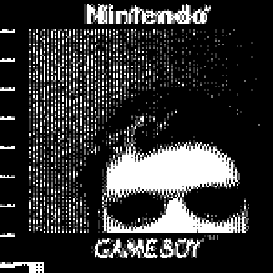

Extract Gameboy Camera images with MadCatz cable.

A more recently updated version of this project with batch download & fewer dependencies [can be found here](https://github.com/Difegue/gblnk).

To use:

 * `./gblnk test.bmp`
 * Press 'print' on the Gameboy.
 * Wait for spinner to finish.
 * Picture appears.

Image tweaking interface:

 * 'A' makes it small
 * 'D' makes it big
 * 'S' saves it as filename specified on the command line
 * 'Esc' exits at any time.

The files madcatz.c & madcatz.txt were written by someone else and originally came from here: http://www.geocities.com/grinara/ (site no longer operating)
